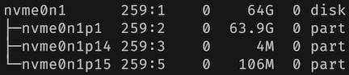

### Extend Live Root Volume
##### EC2 | Ubuntu
List disks, note the device to extend, and if it is a disk or a partition.
> `lsblk`
> Example: /dev/nvme0n1
> 

Identify the filesystem
> `df -hT`

Grow partition and resize the volume.
> `growpart /dev/nvme0n1 1`

Resize the volume
> ext4: `resize2fs /dev/nvme0n1p1`
>
> xfs: `xfs_growfs -d /`
